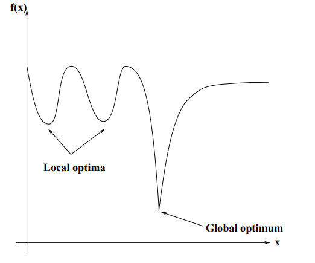
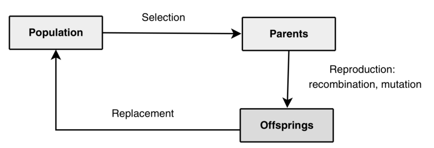
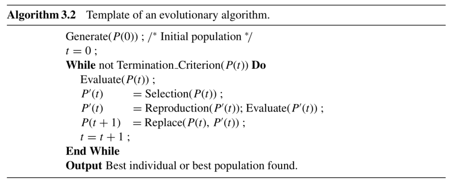
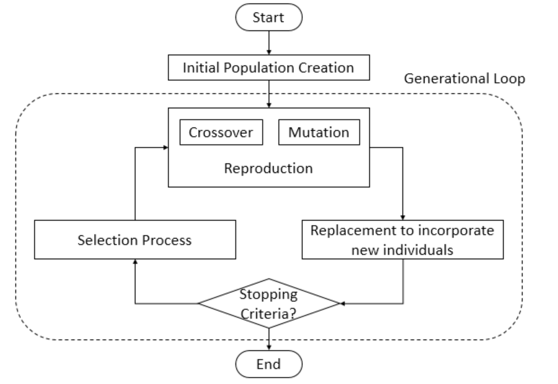
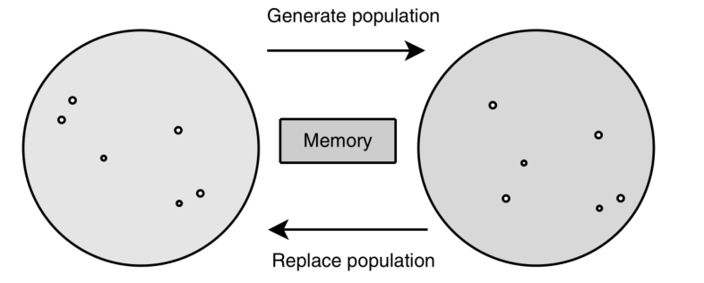
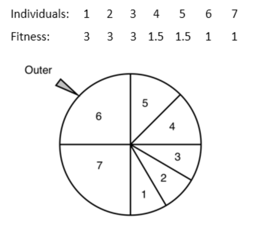
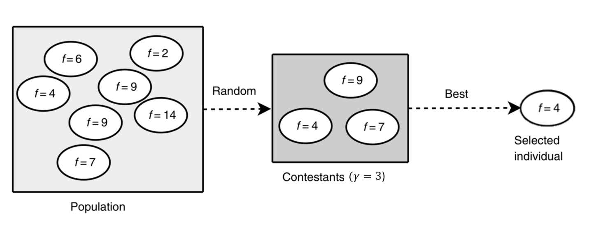
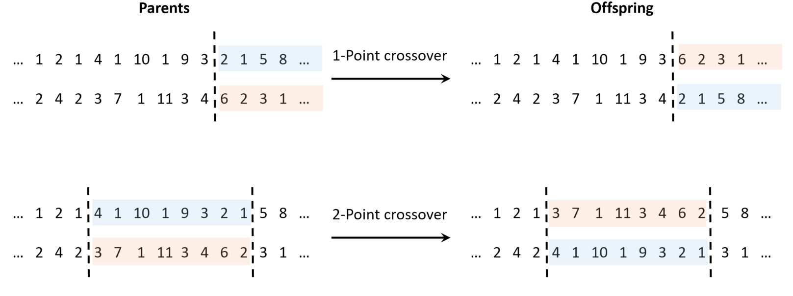
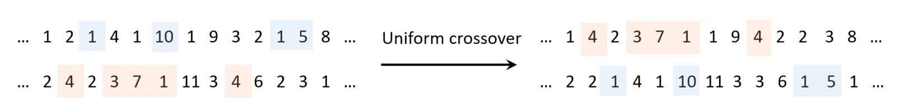

# Large-Scale GA
### A genetic algorithm developed for a large scale problems with discrete representation.

This library contains different GA operators ready to be used in small or large optimization problems such as:

Random value generator functions:
- *i4_uniform_ab*
- *r8_uniform_ab*

Selection strategies operators:
- Roulette wheel selection: *selector*
- Tournament selection: *tournament*

Crossover:
- Uniform crossover: *Shufllex*
- 1-Point crossover: *Xover1point*
- 2-Point crossover: *Xover2point*

Mutation:
- Random resetting mutation: *randomResetting*
- Bias resetting mutation: *biasResetting*
- Creep mutation: *creepMutation*

WARNING: These operators were developed **ONLY** for **discrete solution representations**!

The next sections describe briefly the theory of Genetic Algorithms and its operators provided by this library.

# Genetic Algorithms

Genetic Algorithms (GAs) have the ability to deliver a ’good-enough’ solution ’fast-enough’. This makes GAs attractive for use in solving optimization problems. The reasons why GAs are needed are as follows. In NP-Hard problem the most powerful computing systems take an immense amount of time to solve the problem to optimality or to near-optimality.
In such a scenario, GAs prove to be an efficient tool to provide usable near-optimal solutions in a short amount of time.

Traditional calculus based methods work by starting at a random point and by moving in the direction of the gradient, until the top of the hill is reached. This technique is efficient and works very well for single-peaked objective functions like the cost function in linear regression. But, in most real-world situations, a very complex problem arises called as landscapes, which are made of many peaks and many valleys, which causes such methods to fail, as they suffer from an inherent tendency of getting stuck at the local optima, see figure bellow.

(Source: E.-G. Talbi. Metaheuristics: From Design to Implementation. Wiley Publishing, 2009. ISBN 0470278587, 9780470278581.)

GAs have several advantages over other metaheuristics such as:
- Search efficiently in problem with large spaces and large number of parameters involved;
- Robust with respect to the complexity of the search problem;
- Use a population of solution instead of searching only one solution at a time.

However, they also present some limitations such as:
- Fitness values are calculated repeatedly which might be computationally expensive for some problems;
- Due to their stochastic nature, there are no guarantees on the optimality or the quality of the solution;
- A good understanding of the problem is required in order to properly implement, otherwise GA may not converge to the optimal or near-optimal solution.

## Fundamentals of GAs

### Terminology

1. **Population**: It is a subset of all the possible solutions in an encoded form to the given problem.
2. **Individual or chromosome**: is one such encoded solution to the given problem.
3. **Gene**: is one element position of an individual.
4. **Allele**: a variant of a gene, i.e. the value of a symbol in a specified position of the genotype.
5. **Genotype**: represents the population in the computation space in which the solutions are repre- sented in a way which can be easily understood and manipulated using a computing system.
6. **Phenotype**: represents the population in the actual problem’ solution space in which solutions are represented in a way they can be read by the actual mathematical model’s objective function.
7. **Decoding and Encoding**: decoding is a process of transforming a solution from the genotype to the phenotype space, while encoding is a process of transforming from the phenotype to genotype space.
8. **Fitness**: An objective function associates a fitness value with every individual indicating its suitability to the problem.
9. **Genetic Operators**: these operators are responsible for altering the genetic composition of the individual. These include crossover and mutation which mimic the living beings’ reproduction process.

### Basic Structure

A basic structure of GA is to be described. GA starts with a set of initial solutions, namely initial population, which are represented by individuals. Using a selection technique, an individual from the population is picked depending on its fitness to be part of the parents population. The latter are subjected to reproduction by applying crossover and mutation operators to generate new offsprings which are constructed from the different attributes of individuals belonging to the current population. Finally, the resulting offsprings replace the existing individuals in the population and the process repeats iteratively. The image bellow illustrates one iteration or generation of the described algorithm.

A generalized pseudo-code for a GA is shown in the following algorithm scheme.

### Algorithm Scheme

GA starts with a initial set of solutions, each one of them represented by a chromosome. This initial set is known as the initial population. Then, the latter will be reproduced in the generation loop. In this phase, a new population of solutions is created. Firstly, the individuals will be subject to reproduction by using the genetic operators crossover and mutation originating the new individuals, namely offsprings. Secondly, according to a replacement strategy, the population is updated by replacing the previous individuals by the new ones. Thirdly, by using an appropriate selection strategy an individual from one population is picked depending on its fitness and used to form a new offspring. This process repeated until GA reached the stopping criteria. The figure bellow shows the flowchart of a GA.

GA iteratively applies the generation of new population and the replacement of a new one, see figure bellow. This is possible because the history of the previous search, i.e. the populations of the previous generations, is stored in a memory which can be used in the generation of the new population and the replacement of the old one.

# Selection strategy 

The main principle of selection is “the fitter is an individual, the higher is its chance of being parent.” This principle inflict a selection pressure on the individuals which is responsible to drive the population to better solutions. However, worst individuals, i.e. unfit individuals, should not be discarded because they may have useful genetic material. Therefore, they have some chance to be selected. To determine such an individual’s ranking from the best to the worst it is necessary to accomplish a fitness assignmentupon the candidates individuals.

## Roulette Wheel Selection
This strategy assigns to each individual a selection probability that is proportional to its relative fitness. To better understand this strategy, one can visualise a pie graph in the figure below where each individual is assigned a pie’ slice on the graph which corresponds to its fitness. Around the pie, an outer roulette wheel is set. The selection of µ individuals is performed by µ independent roulette wheel’ spins. Each spin will select just one individual. Fitter individuals have more bigger slices, thus more chance to be chosen.

## Tournament Selection
This strategy consists in selecting k individuals randomly. The parameter k dictates the number of contestants in the tournament. A tournament is then applied to the k members of the group to select the best one as the figure 5.10 illustrates. To select µ individuals, the tournament procedure is performed µ times.

# Genetic Operators

Once the selection of individuals to form the parents population is performed, the reproduction phase takes place with the application of genetic operators such as the crossover and mutation.

## Crossover

The function of crossover is to interchange some genetic material, i.e. characteristics, of the two parents to generate offspring. Its design mainly depends on the representation (encoding) used. Moreover, the performance of this operator largely depends on the its user-defined parameter, the crossover rate p c that spans from 0 to 1. This parameter represents the proportion of parents on which the crossover will perform.

### N-point crossover

This is the generalized form of a group of different crossover operators, each one differentiating by the number of crossing points which originates segments of the chromosome ready to be interchanged among the parents’ chromosomes. In the 1-point crossover, a crossover point κ is computed randomly which spans the chromosome’s length. Then, two segments per chromosome are formed separated in the κth position and thereafter interchanged them resulting in two offspring as the figure bellow depicts. In the 2-point crossover, two crossover points are computed randomly and then following the same method as the previous operator, they interchange genetic material within the two points as the figure bellow depicts.

### Uniform crossover

In the uniform crossover, two individuals can be recombined without taking into account the size of segments. Each element of the offspring is selected randomly from either parent. Each parent will contribute equally to generate the offspring as the figure bellow shows.

## Mutation

The function of mutation is to perform independently small changes in selected individuals of the popu-lation in order to introduce in the offspring’s some new features (hopefully desirable features) which arenot possessed by its parents. These small changes in the genetic material of the offspring, maintain and introduce diversity in the genetic population. Moreover, it allows the GA to explore a new, maybe better part of the feasible region than the ones previously considered and consequently escaping from local minima.

### Random resetting mutation

In the random resetting mutation, a random allele from the set of permissible values Ω is assigned to a randomly chosen gene. 

### Bias resetting mutation

A new operator was designed by extending the random resetting one. Instead of setting a equal probability to all alleles, it is possible to set a distribution from which the random numbers are drawn. The goal of using these modelled distribution is to control the likelihood of the numbers’ drawing in such a way that the first options are more likely to be drawn than the last ones. For that purpose, two distributions were modelled namely a half-normal distribution and a normal distribuition.

### Creep mutation

This operator scheme was designed for representations with ordinal attributes and therefore fits in the encoding of this problem. Its function is to add small positive or negative values to each gene with a given probability. From a distribution that is symmetric about zero, the probabilities associated with the values to be added are sampled randomly for each position. Thereby, is more likely to generate small changes than large ones. To design this operator a distribution must be chosen and its parameters must be tuned, hence controlling the distribution from which the random alleles are drawn. For this purpose, the well known normal distribution is the one to be used.
