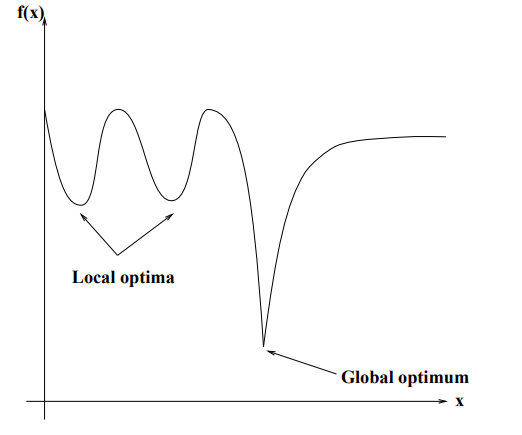

# Large-Scale_GA
### A genetic algorithm developed for a large scale binary problems.

Genetic Algorithms (GAs) have the ability to deliver a ’good-enough’ solution ’fast-enough’. This makes GAs attractive for use in solving optimization problems. The reasons why GAs are needed are as follows. In NP-Hard problem the most powerful computing systems take an immense amount of time to solve the problem to optimality or to near-optimality.
In such a scenario, GAs prove to be an efficient tool to provide usable near-optimal solutions in a short amount of time.

Traditional calculus based methods work by starting at a random point and by moving in the direction of the gradient, until the top of the hill is reached. This technique is efficient and works very well for single-peaked objective functions like the cost function in linear regression. But, in most real-world situations, a very complex problem arises called as landscapes, which are made of many peaks and many valleys, which causes such methods to fail, as they suffer from an inherent tendency of getting stuck at the local optima, see figure bellow.

(Source: E.-G. Talbi. Metaheuristics: From Design to Implementation. Wiley Publishing, 2009. ISBN 0470278587, 9780470278581.)

GAs have several advantages over other metaheuristics such as:
- Search efficiently in problem with large spaces and large number of parameters involved;
- Robust with respect to the complexity of the search problem;
- Use a population of solution instead of searching only one solution at a time.

However, they also present some limitations such as:
- Fitness values are calculated repeatedly which might be computationally expensive for some problems;
- Due to their stochastic nature, there are no guarantees on the optimality or the quality of the solution;
- A good understanding of the problem is required in order to properly implement, otherwise GA may not converge to the optimal or near-optimal solution.

### Fundamentals of GAs

GA metaheuristic can be classified as according to some criteria such as:
- Nature inspired: it is based on the concepts of natural selection and genetics;
- Memory usage: it uses a memory that contains some information extracted on-line during the
search which is limited to the population of solutions;
- Stochastic: different final solutions may be obtained from the same initial solution;
- Population-based search: in this algorithm a whole population of solutions is evolved;
- Iterative: start with a population of solutions and transform it at each iteration using some search
operators.

### Terminology

1. **Population**: It is a subset of all the possible solutions in an encoded form to the given problem.
2. **Individual or chromosome**: is one such encoded solution to the given problem.
3. **Gene**: is one element position of an individual.
4. **Allele**: a variant of a gene, i.e. the value of a symbol in a specified position of the genotype.
5. **Genotype**: represents the population in the computation space in which the solutions are repre- sented in a way which can be easily understood and manipulated using a computing system.
6. **Phenotype**: represents the population in the actual problem’ solution space in which solutions are represented in a way they can be read by the actual mathematical model’s objective function.
7. **Decoding and Encoding**: decoding is a process of transforming a solution from the genotype to the phenotype space, while encoding is a process of transforming from the phenotype to genotype space.
8. **Fitness**: An objective function associates a fitness value with every individual indicating its suit- ability to the problem.
9. **Genetic Operators**: these operators are responsible for altering the genetic composition of the individual. These include crossover and mutation which mimic the living beings’ reproduction process.
